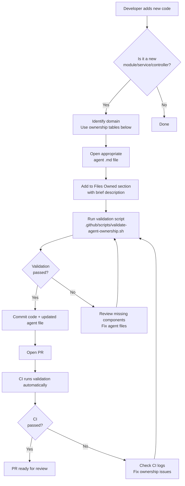

# Agent Ownership Maintenance Guide

## Purpose

This guide ensures that when new files, modules, services, controllers, or migrations are added to the OneBook codebase, they are properly documented in the appropriate agent instruction files under `.github/agents/`.

## Why This Matters

The sub-agent architecture relies on clear ownership boundaries. Each agent instruction file documents which files and modules it owns. When new code is added without updating these ownership declarations:

1. **Agents lose context** - Future agents may not know who owns the new code
2. **Patterns diverge** - Without clear ownership, code may not follow established conventions
3. **Collaboration breaks** - Cross-cutting concerns become unclear
4. **Onboarding suffers** - New developers can't easily understand system boundaries

## Workflow Diagram



## Ownership Rules

### Backend Services (`backend/src/main/java/com/nexus/onebook/service/`)

| Service Type | Owner Agent | File |
|-------------|-------------|------|
| Core accounting (Journal, Ledger, TrialBalance, etc.) | @backend | `backend.agent.md` |
| Financial reports (P&L, BalanceSheet, CashFlow) | @backend | `backend.agent.md` |
| Fixed Asset Register | @backend | `backend.agent.md` |
| Multi-currency, Export, Credit Management | @backend | `backend.agent.md` |
| Cheque Management, Payments | @backend | `backend.agent.md` |
| Encryption, Blind Index, KeyManagement, AuditLog | @security | `security.agent.md` |
| Document Vault (encrypted storage) | @security | `security.agent.md` |
| Warm Cache | @infra | `infra.agent.md` |
| Ingestion adapters (HL7, ISO20022, DMS, Webhook) | @backend | `backend.agent.md` |
| OCR, 3-Way Matching, Corporate Card sync | @backend | `backend.agent.md` |
| Inventory (Stock, Batch, BOM, Reorder) | @backend | `backend.agent.md` |
| Payroll integration | @backend | `backend.agent.md` |
| Forecasting, MarkToMarket, CorporateAction | @backend | `backend.agent.md` |
| Scenario Modeling, MarketSentiment | @backend | `backend.agent.md` |
| Anomaly Detection, DigitalAsset | @backend | `backend.agent.md` |
| Compliance, TDS/TCS, FeatureEntitlement | @backend | `backend.agent.md` |
| BankReconciliation, Intercompany | @backend | `backend.agent.md` |
| TenantLocale | @backend | `backend.agent.md` |
| AuditorPortal, SecurityAudit, Observability | @security | `security.agent.md` |
| DisasterRecovery | @infra | `infra.agent.md` |
| WhatsApp notifications | @backend | `backend.agent.md` |

### Backend Controllers (`backend/src/main/java/com/nexus/onebook/controller/`)

Controllers follow the same ownership as their corresponding services. Add the controller to the same agent file as the service it calls.

### Frontend Modules (`frontend/src/app/`)

| Module | Owner Agent | File |
|--------|-------------|------|
| `keyboard/` | @frontend | `frontend.agent.md` |
| `i18n/` | @frontend | `frontend.agent.md` |
| `accounting/` | @frontend (UI), @backend (data contracts) | `frontend.agent.md` |
| `banking/` | @frontend | `frontend.agent.md` |
| `dashboard/` | @frontend | `frontend.agent.md` |
| `gst/` | @frontend (UI), @backend (tax logic) | `frontend.agent.md` |
| `inventory/` | @frontend | `frontend.agent.md` |
| `master/` | @frontend | `frontend.agent.md` |
| `reports/` | @frontend (UI), @backend (report logic) | `frontend.agent.md` |
| `receivable/` | @frontend (UI), @backend (data contracts) | `frontend.agent.md` |
| `market/` | @frontend (UI), @backend (data contracts) | Both files |
| `ai/` | @frontend (UI), @backend (data contracts) | Both files |
| `auditor/` | @frontend (UI), @security (workflows) | Both files |

**Note**: Frontend modules are primarily owned by @frontend for UI patterns and component structure. @backend owns the data contracts and business logic.

### Database Migrations (`backend/src/main/resources/db/migration/`)

| Migration | Owner Agent | File |
|-----------|-------------|------|
| V1__rls_infrastructure.sql | @security | `security.agent.md` |
| V2__organizational_hierarchy.sql | @backend | `backend.agent.md` |
| V3__ledger_and_journal.sql | @backend | `backend.agent.md` |
| V4__seed_data.sql | @backend | `backend.agent.md` |
| V5__blind_dba_infrastructure.sql | @security | `security.agent.md` |
| V6__ingestion_layer.sql | @backend | `backend.agent.md` |
| V7__reporting_compliance_far.sql | @backend + @backend | `backend.agent.md` |
| V8__ai_intelligence_features.sql | @backend | `backend.agent.md` |
| V9__hardening_audit_production.sql | @security | `security.agent.md` |
| V10__tally_features.sql | @backend (primary) | `backend.agent.md` |

## How to Update Agent Files

### When Adding a New Backend Service

1. **Identify the domain**: What is the primary responsibility of this service?
2. **Find the owner agent**: Use the table above to determine which agent owns this domain
3. **Update the agent file**: 
   - Open `.github/agents/<agent-name>.md`
   - Find the `### Files Owned` section
   - Under `#### Backend - [Subsection]`, add the service with a brief description
   - Example: `- ServiceName.java - Brief description of what it does`

### When Adding a New Backend Controller

1. Controllers follow service ownership - add to the same agent that owns the service
2. Update the agent file's `### Files Owned` section
3. Add under the controllers subsection with the service it exposes

### When Adding a New Frontend Module

1. **UI ownership**: @frontend owns ALL frontend module UI and component structure
2. **Data contracts**: The backend agent (e.g., @backend) owns business logic
3. **Update process**:
   - Add module to `frontend.agent.md` under the Scope section
   - Add collaboration note: `(collaborates with @backend for data contracts)`
   - If data contracts are complex, also add to `backend.agent.md`

### When Adding a New Database Migration

1. **Identify primary domain**: What tables/features does the migration add?
2. **Update the relevant agent**: Add migration file with a brief description
3. **Cross-cutting migrations**: If migration spans multiple domains, document in primary owner with a comprehensive description

### When Adding New Documentation

1. Technical documentation owned by @docs
2. API docs → @backend (or relevant domain agent)
3. Architecture docs → @infra
4. Security docs → @security

## Validation

### Automated Validation Script

Run the validation script to detect missing ownership declarations:

```bash
./.github/scripts/validate-agent-ownership.sh
```

This script will:
- ✅ Check all frontend modules are documented
- ✅ Check all backend services are documented
- ✅ Check all backend controllers are documented
- ✅ Check all backend packages are documented
- ⚠️ Warn about undocumented migrations (non-fatal)

**When to run:**
- Before submitting a PR that adds new code
- As part of CI/CD (see below)
- Periodically as maintenance

### CI/CD Integration

The validation script can be integrated into the CI pipeline to catch missing ownership declarations early:

```yaml
# Add to .github/workflows/ci.yml
- name: Validate Agent Ownership
  run: ./.github/scripts/validate-agent-ownership.sh
```

## Step-by-Step Checklist

When adding new code to OneBook, follow this checklist:

- [ ] Code is written and tested
- [ ] Identify which agent domain the code belongs to (use tables above)
- [ ] Open the appropriate agent instruction file in `.github/agents/`
- [ ] Add the new file/module to the `### Files Owned` section
- [ ] Include a brief description of what the component does
- [ ] If cross-cutting, add collaboration notes to other relevant agents
- [ ] Run `./validate-agent-ownership.sh` to verify completeness
- [ ] Commit the updated agent file(s) with your code changes

## Examples

### Example 1: Adding a New AI Service

**New file**: `backend/src/main/java/com/nexus/onebook/service/SentimentAnalysisService.java`

**Steps:**
1. Domain: AI/Intelligence → Owner: @backend
2. Open `.github/agents/backend.agent.md`
3. Find the `### What You Own` section
4. Add: `- SentimentAnalysisService.java - Social media sentiment analysis for market trends`
5. Also add corresponding controller if created
6. Run validation script
7. Commit changes

### Example 2: Adding a New Frontend Module

**New directory**: `frontend/src/app/procurement/`

**Steps:**
1. UI Domain: Frontend → Owner: @frontend
2. Business Domain: Procurement → Likely @backend (supply chain or accounts payable)
3. Open `.github/agents/frontend.agent.md`
4. Under the Module Structure section, add:
   ```
   - `frontend/src/app/procurement/` - Procurement and purchase order management (collaborates with @backend for AP integration)
   ```
5. If significant business logic, also add to `backend.agent.md`
6. Run validation script
7. Commit changes

### Example 3: Adding a Database Migration

**New file**: `backend/src/main/resources/db/migration/V11__project_costing.sql`

**Steps:**
1. Review migration content to identify domain (e.g., project costing → accounting)
2. Owner: @backend
3. Open `.github/agents/backend.agent.md`
4. Under `#### Database Migrations`, add:
   ```
   - `backend/src/main/resources/db/migration/V11__project_costing.sql` - Project costing and job tracking tables
   ```
5. Run validation script
6. Commit changes

## Troubleshooting

### Validation Script Fails

**Problem**: Script reports missing components

**Solution**:
1. Review the missing components listed
2. Use the ownership tables above to identify the correct owner
3. Update the appropriate agent file(s)
4. Re-run validation

### Not Sure Which Agent Owns New Code

**Solution**:
1. Review `INDEX.md` for quick reference
2. Look at similar existing code to see which agent owns it
3. If still unclear, default to:
   - Core accounting → @backend
   - External integrations → @backend
   - Frontend UI → @frontend
   - Security/encryption → @security

### Cross-Cutting Concerns

**Problem**: New code spans multiple agent domains

**Solution**:
1. Identify the **primary owner** (who has the main responsibility)
2. Document in primary owner's file with full details
3. Add **collaboration notes** in other agents' files
4. Example: Market valuation UI
   - Primary: @backend (owns the valuation logic)
   - Secondary: @frontend (owns the UI)
   - Both files mention the module with collaboration notes

## Best Practices

1. **Update ownership immediately** - Don't wait until PR review, update agent files as you write code
2. **Be specific** - Include file names, not just vague descriptions
3. **Add descriptions** - Brief 1-line description helps future maintainers
4. **Run validation early** - Catch missing ownership before PR submission
5. **Keep it current** - If you refactor or move code, update ownership accordingly
6. **Document collaboration** - When multiple agents share responsibility, document it explicitly

## Automation Future Enhancements

Potential improvements to make ownership tracking even more automatic:

1. **Pre-commit hook**: Run validation automatically before each commit
2. **PR validation**: GitHub Action that comments on PRs with missing ownership
3. **Auto-suggest ownership**: Script that analyzes new files and suggests which agent based on patterns
4. **Ownership badges**: Add ownership comments in code files themselves (e.g., `@owner @backend`)
5. **Ownership dashboard**: Web UI showing ownership coverage and gaps

## Related Documentation

- [Agent Instructions README](./README.md) - How to use agent instructions
- [Design Requirements Index](./INDEX.md) - Quick reference by category
- [Validation Script](../scripts/validate-agent-ownership.sh) - Automated ownership checker

---

**Last Updated:** 2026-03-13  
**Maintained By:** @docs
