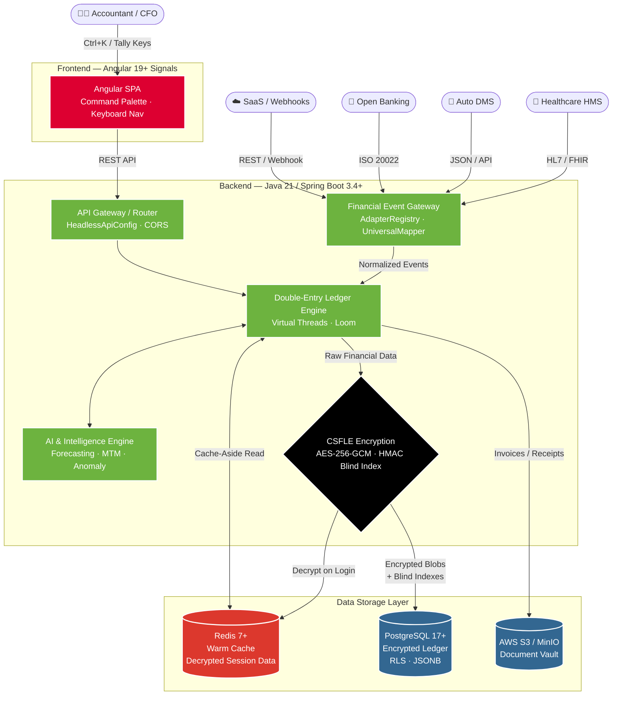

# OneBook — System Architecture

> High-level Mermaid.js architecture diagram for the Nexus Universal Accounting OS.
> For detailed diagrams (data flow, security, cache, deployment), see [`technical/architecture-diagram.md`](technical/architecture-diagram.md).

## Architecture Documentation

| Document | Description |
|----------|-------------|
| [Architecture Diagrams](technical/architecture-diagram.md) | Mermaid.js diagrams: system, data flow, security, cache, deployment |
| [Key-Binding Registry](technical/key-binding-registry.md) | Tally shortcuts, Command Palette, conflict resolution, extensibility |
| [SQL Schema](technical/sql-schema.md) | Universal Secured Ledger schema (V1–V8 migrations) |
| [API Documentation](technical/api-documentation.md) | REST API reference for all endpoints |
| [Developer Guide](technical/developer-guide.md) | Onboarding, setup, coding standards, workflows |
| [Operational Runbook](technical/operational-runbook.md) | Deployment, monitoring, troubleshooting, backup |
