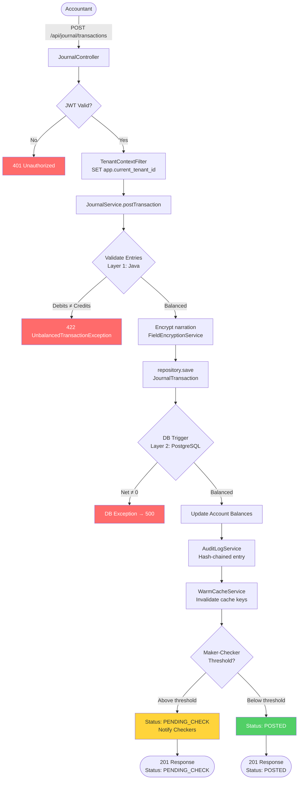
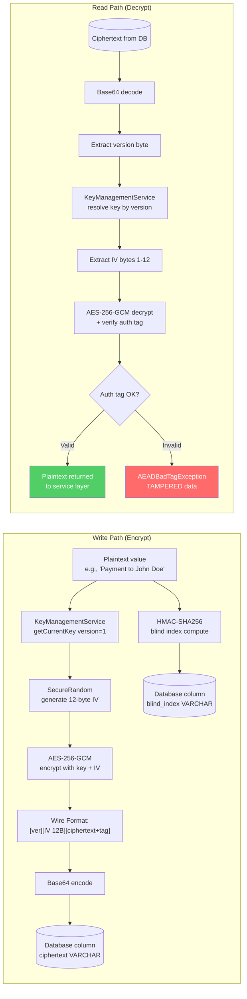
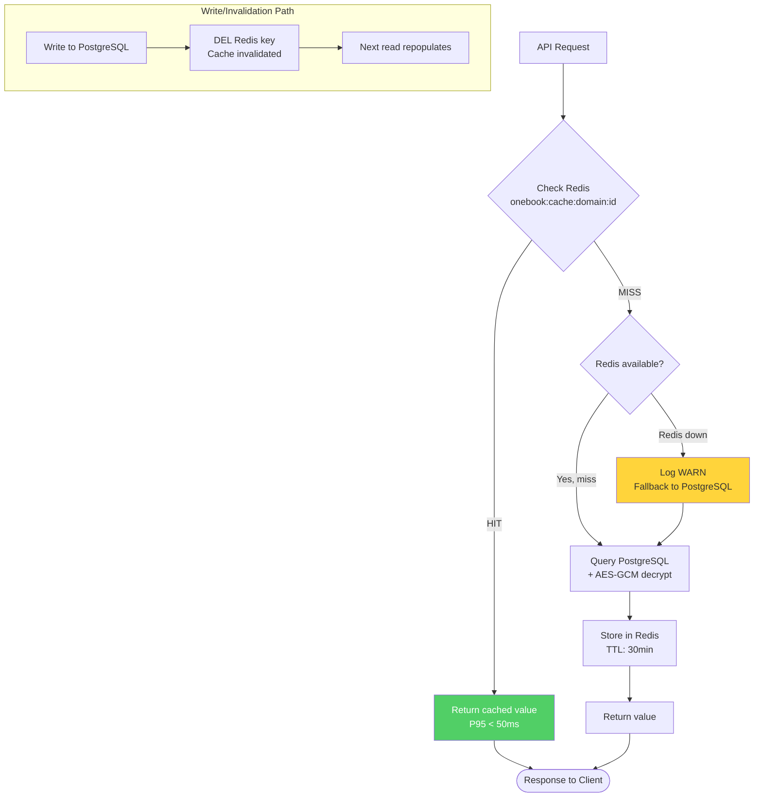
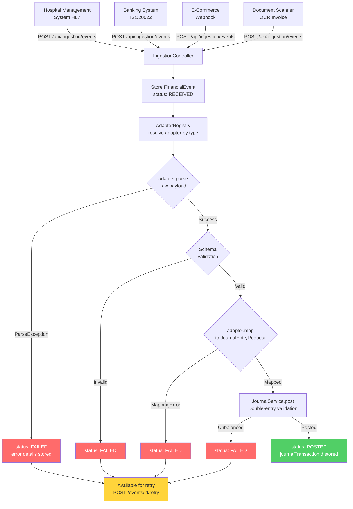
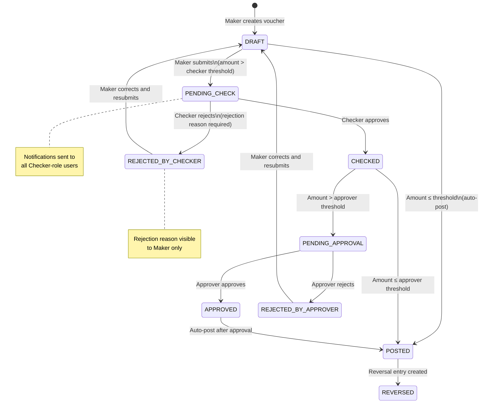
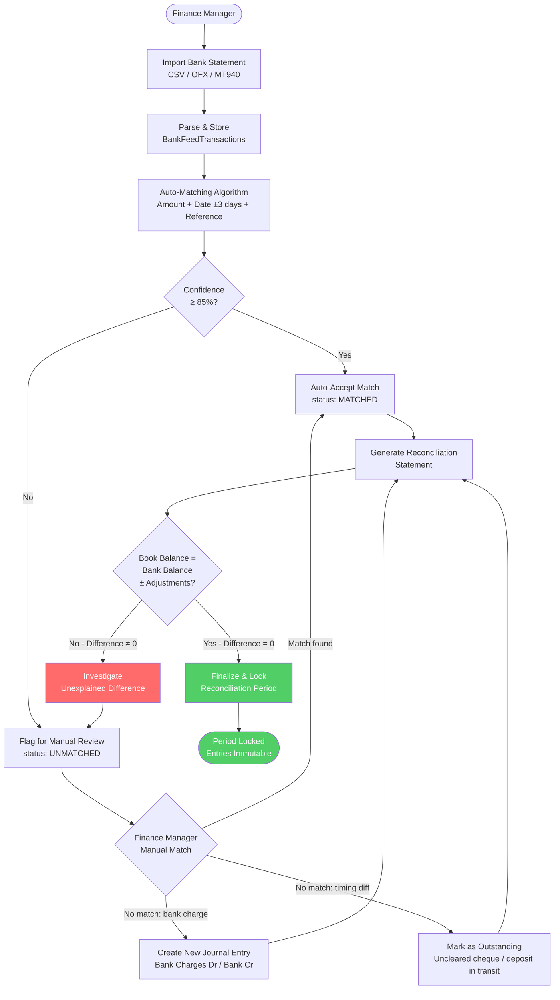
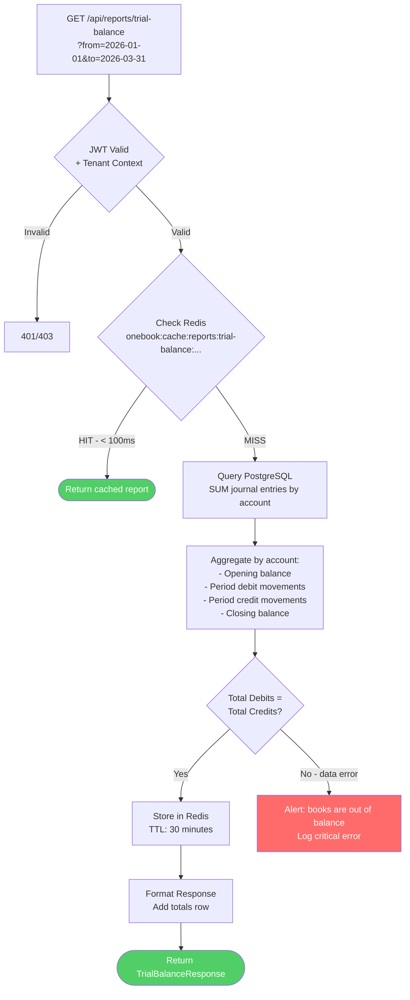
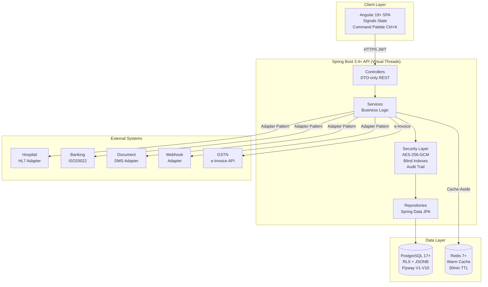

# Workflow Diagrams
## OneBook — Nexus Universal Accounting OS

> **Mermaid process flow diagrams for all major OneBook workflows.**  
> Last Updated: 2026-03-18 | Owner: @Architect

---

## 1. Journal Entry Posting Flow



---

## 2. Encryption/Decryption Flow



---

## 3. Cache-Aside Pattern



---

## 4. Financial Event Ingestion Pipeline



---

## 5. Maker-Checker-Approver Workflow



---

## 6. Bank Reconciliation Process



---

## 7. Trial Balance Generation



---

## 8. TDS/TCS Deduction Flow

```mermaid
flowchart TD
    START([Accountant posts\nPayment Voucher]) --> CHECK_TYPE{Voucher Type\nincludes payee PAN\n+ section code?}
    
    CHECK_TYPE -->|No| SKIP[Post directly\nNo TDS deduction]
    CHECK_TYPE -->|Yes| FETCH[Fetch TDS section\nrate and threshold]
    
    FETCH --> THRESHOLD{Payment amount\n> section threshold?}
    THRESHOLD -->|No| SKIP
    THRESHOLD -->|Yes| LOWER_CERT{Lower deduction\nForm 13 submitted?}
    
    LOWER_CERT -->|Yes| LOWER_RATE[Apply lower rate\nfrom Form 13]
    LOWER_CERT -->|No| STD_RATE[Apply standard\nsection rate]
    
    LOWER_RATE & STD_RATE --> COMPUTE[TDS Amount =\npayment × rate]
    
    COMPUTE --> ENTRIES[Create Journal Entries:\nDr: Expense (full amount)\nCr: TDS Payable (TDS amount)\nCr: Accounts Payable (net amount)]
    
    ENTRIES --> REGISTER[Record in\nTDS Deduction Register]
    REGISTER --> EINVOICE{Invoice ≥ ₹5L\nB2B transaction?}
    
    EINVOICE -->|Yes| IRN[Generate e-Invoice\nIRN via GSTN API]
    EINVOICE -->|No| POST([Post Voucher\nStatus: POSTED])
    
    IRN --> POST

    style POST fill:#51cf66,color:#fff
    style SKIP fill:#74c0fc,color:#333
```

---

## 9. System Architecture Overview



---

*Diagrams use Mermaid.js syntax. Render with any Mermaid-compatible viewer (GitHub, GitLab, Notion, etc.).*
